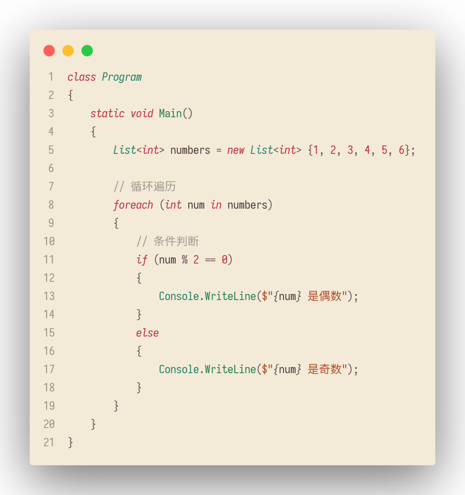
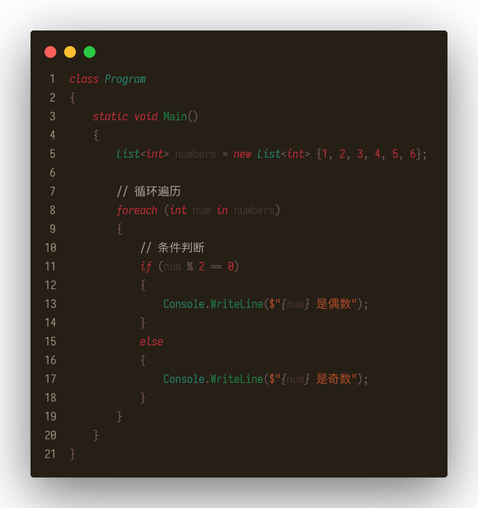
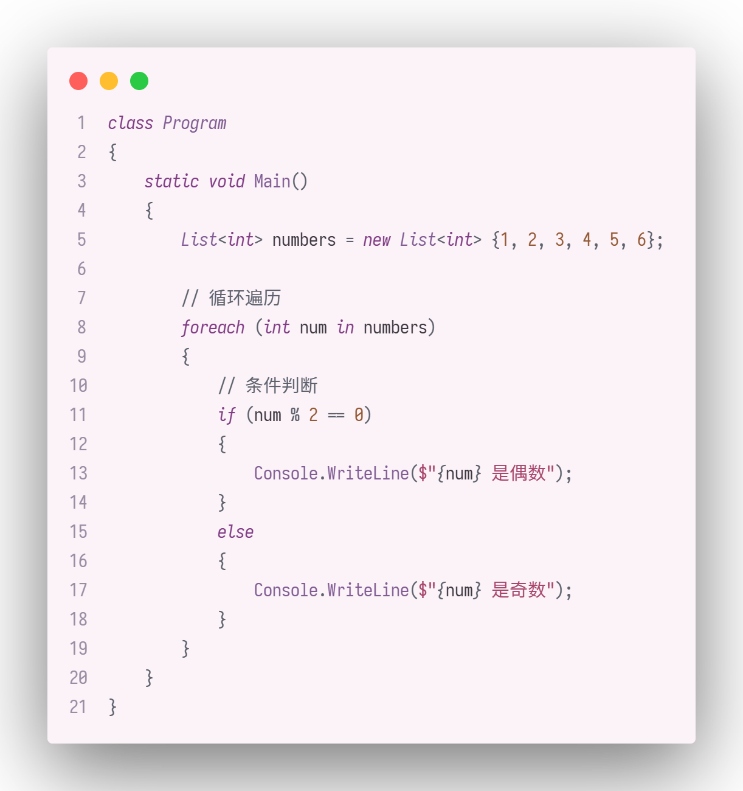
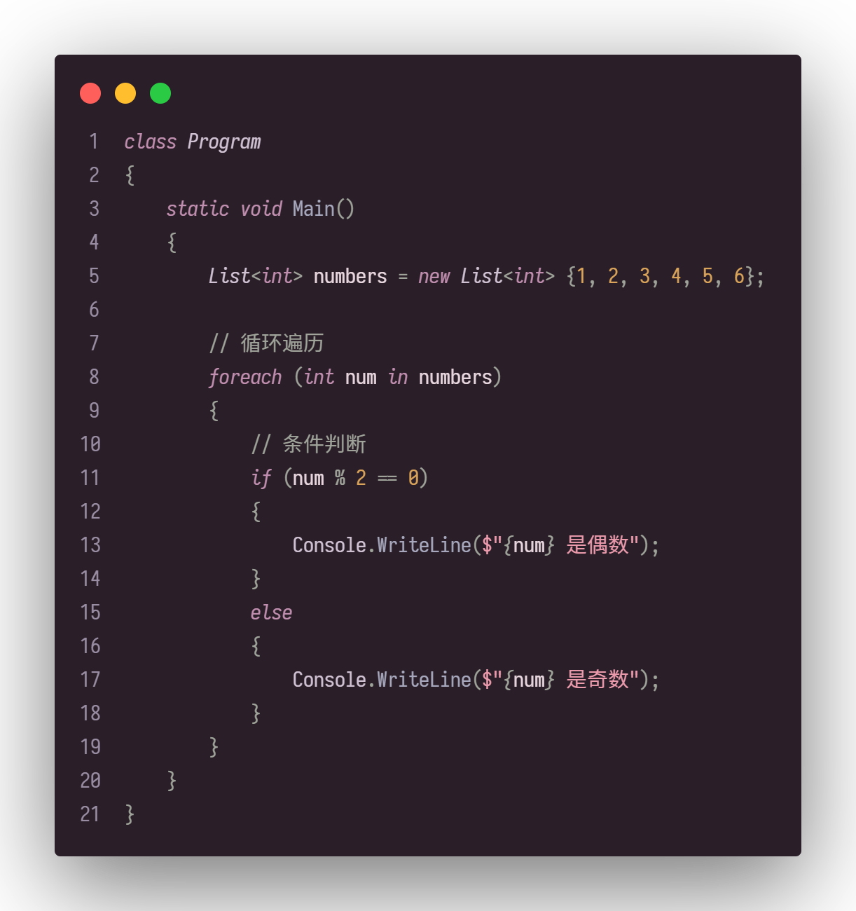
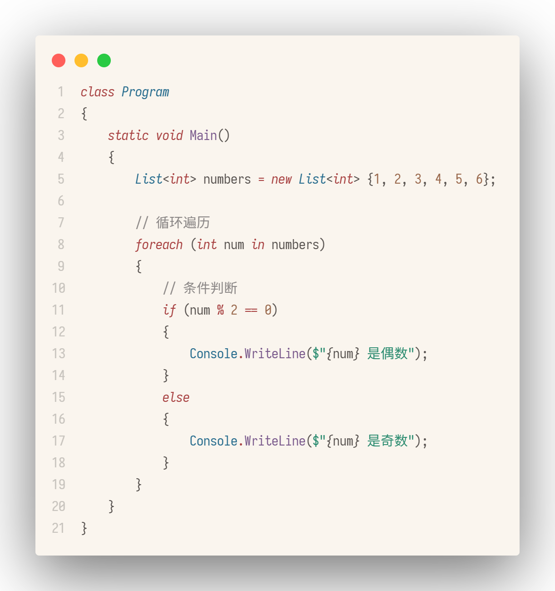
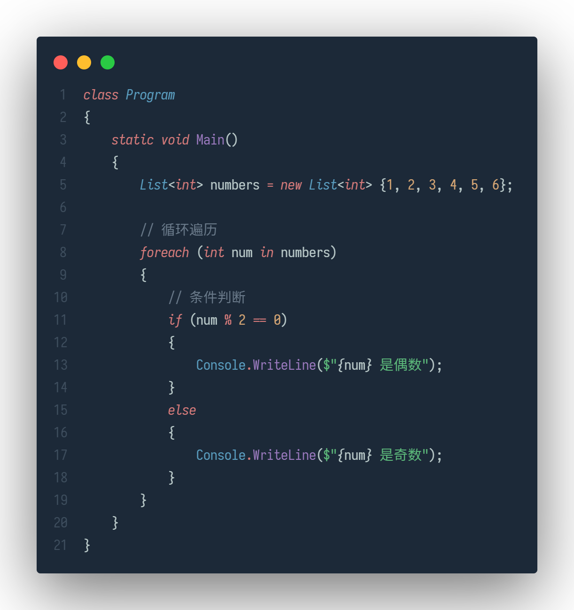

# 素缃 · Su Xiang

|      |      |      |
| :---: | :---: | :---: |
||
[](https://marketplace.visualstudio.com/items?itemName=Mosaulse.suxiang-theme)||
[](https://open-vsx.org/extension/Mosaulse/suxiang-theme)||

---

[English](README_EN.md)

# 素缃 — VSCode 古典配色主题

*一卷素缃，落于代码之上，如旧书颜色，浸入行间。*

---

## 缘起

> 缣缃满篋，未忍轻开。  
> ——《颜氏家训 · 勉学》

**素缃**，是一卷取法东方古籍之美的 `VSCode` 颜色主题，共含**三系六卷**。

「**素**」者，未经染色之生绢也。《礼记》云：「大夫素带辟垂。」素，是底色，是留白，是一切浓墨重彩尚未落下之前的安宁。

「**缃**」者，浅黄色之帛也。《说文解字》释：「缃，帛浅黄色也。」它是古卷扉页的颜色，是岁月与光阴的落款——书卷经年，纸页泛黄，那层温润的缃色，便是时间写下的第一行注脚。

此主题无刺目之荧白，亦无深渊之漆墨。唯余岁月浸润后的温润纸色，沉淀经年的褪淡墨迹，郑重钤下的朱砂印红，以及如青碧玉般温润的翠色标题。仿佛在午后斜阳中，或烛灯摇影下，徐徐摊开一卷旧籍——所有的代码，都变得安静而有温度。

---

## 三系六卷

此主题以中国传统色谱为本，分**素缃**、**紫缃**、**芙蕖**三系，各含亮暗两卷，共成六种意境。

### 素缃系列 — 古卷墨香

取自古籍纸墨之色，素绢为底，朱砂断句，青碧提纲。如展一卷宋版书，墨香盈室。

### 紫缃系列 — 烛影紫烟

取自暮色烛光之色，紫烟深沉，粉笺如霞。如夜读于烛下，代码在深紫中静默流转。

### 芙蕖系列 — 清水芙蓉

取自荷花与碧水之色，月影斜照，暗香浮动。如夏夜池畔，代码在青碧中清凉如水。

---

## 🎨 视觉预览

| 朝霞 · 素缃（Dawn — Suxiang） | 暮色 · 素缃（Dusk — Suxiang） | 晓烟 · 紫缃（Dawnmist — Zixiang） | 烛影 · 紫缃（Candlelight — Zixiang） | 晨露 · 芙蕖（Morning Dew — Fuqu） | 月影 · 芙蕖（Moon Shadow — Fuqu）
| :---: | :---: | :---: | :---: | :---: | :---: |
| `晨起推窗，素缃初展。朝霞映纸，墨香盈室。` | `暮色四合，烛影摇红。古卷泛黄处，诗意暗流淌。` | `晓烟轻笼，紫气初生。粉笺如霞，墨痕带露。` | `烛影摇曳，紫烟深沉。夜色如绢，字迹如萤。` | `晨露初凝，芙蕖含苞。清新如晨，碧叶承珠。` | `月影斜照，芙蕖静谧。夜色如水，暗香浮动。` |
|  | |  |  |  |  |

<!-- 
### 朝霞 · 素缃（Dawn — Suxiang）

> 晨起推窗，素缃初展。  
> 朝霞映纸，墨香盈室。

### 暮色 · 素缃（Dusk — Suxiang）

> 暮色四合，烛影摇红。  
> 古卷泛黄处，诗意暗流淌。

| **朝霞 · 素缃（Dawn — Suxiang）** | **暮色 · 素缃（Dusk — Suxiang）** |
| :---: | :---: |
| | 

---

### 晓烟 · 紫缃（Dawnmist — Zixiang）

> 晓烟轻笼，紫气初生。  
> 粉笺如霞，墨痕带露。

### 烛影 · 紫缃（Candlelight — Zixiang）

> 烛影摇曳，紫烟深沉。  
> 夜色如绢，字迹如萤。

| **晓烟 · 紫缃（Dawnmist — Zixiang）** | **烛影 · 紫缃（Candlelight — Zixiang）** |
| :---: | :---: |
| | 

---

### 晨露 · 芙蕖（Morning Dew — Fuqu）

> 晨露初凝，芙蕖含苞。  
> 清新如晨，碧叶承珠。

### 月影 · 芙蕖（Moon Shadow — Fuqu）

> 月影斜照，芙蕖静谧。  
> 夜色如水，暗香浮动。

| **晨露 · 芙蕖（Morning Dew — Fuqu）** | **月影 · 芙蕖（Moon Shadow — Fuqu）** |
| :---: | :---: |
|  |  |

--- -->

## 🎨 配色体系

> 天地有大美而不言，四象有明法而不议。  
> ——化自《庄子 · 知北游》

此主题循中国传统色谱，以[中国色官网](https://zhongguose.com/)为据，每一色名皆有来历，每一色调皆循古法。

### 素缃系列配色

| 色名 | 亮色值 | 暗色值 | 意象 | 在主题中的角色 |
|------|--------|--------|------|---------------|
| **海报灰** | <span style="display:inline-block;width:16px;height:16px;border-radius:2px;background:#483332;border:1px solid #ddd;"/></span> `#483332` | <span style="display:inline-block;width:16px;height:16px;border-radius:2px;background:#d4c4b7;border:1px solid #ddd;"/></span> `#d4c4b7` | 经年墨迹 | 默认前景 |
| **鼠背灰** | <span style="display:inline-block;width:16px;height:16px;border-radius:2px;background:#73575c;border:1px solid #ddd;"/></span> `#73575c` | <span style="display:inline-block;width:16px;height:16px;border-radius:2px;background:#9a8878;border:1px solid #ddd;"/></span> `#9a8878` | 褪淡注释 | 注释与标点 |
| **高粱红** | <span style="display:inline-block;width:16px;height:16px;border-radius:2px;background:#c02c38;border:1px solid #ddd;"/></span> `#c02c38` | <span style="display:inline-block;width:16px;height:16px;border-radius:2px;background:#f05a46;border:1px solid #ddd;"/></span> `#f05a46` | 朱砂印红 | 关键字与数字 |
| **蟹蝥红** | <span style="display:inline-block;width:16px;height:16px;border-radius:2px;background:#b14b28;border:1px solid #ddd;"/></span> `#b14b28` | <span style="display:inline-block;width:16px;height:16px;border-radius:2px;background:#f1908c;border:1px solid #ddd;"/></span> `#f1908c` | 印章残朱 | 字符串 |
| **薄荷绿** | <span style="display:inline-block;width:16px;height:16px;border-radius:2px;background:#207f4c;border:1px solid #ddd;"/></span> `#207f4c` | <span style="display:inline-block;width:16px;height:16px;border-radius:2px;background:#83a78d;border:1px solid #ddd;"/></span> `#83a78d` | 青碧玉色 | 函数名 |
| **海王绿** | <span style="display:inline-block;width:16px;height:16px;border-radius:2px;background:#248067;border:1px solid #ddd;"/></span> `#248067` | <span style="display:inline-block;width:16px;height:16px;border-radius:2px;background:#579572;border:1px solid #ddd;"/></span> `#579572` | 翠色标题 | 类型与类名 |

### 紫缃系列配色

| 色名 | 亮色值 | 暗色值 | 意象 | 在主题中的角色 |
|------|--------|--------|------|---------------|
| **剑锋紫** | <span style="display:inline-block;width:16px;height:16px;border-radius:2px;background:#3e3841;border:1px solid #ddd;"/></span> `#3e3841` | <span style="display:inline-block;width:16px;height:16px;border-radius:2px;background:#e9d7df;border:1px solid #ddd;"/></span> `#e9d7df` | 暮色深沉 |默认前景 |
| **鱼尾灰** | <span style="display:inline-block;width:16px;height:16px;border-radius:2px;background:#5e616d;border:1px solid #ddd;"/></span> `#5e616d` | <span style="display:inline-block;width:16px;height:16px;border-radius:2px;background:#9fa39a;border:1px solid #ddd;"/></span> `#9fa39a` | 淡墨如烟 |注释与标点 |
| **桔梗紫** | <span style="display:inline-block;width:16px;height:16px;border-radius:2px;background:#813c85;border:1px solid #ddd;"/></span> `#813c85` | <span style="display:inline-block;width:16px;height:16px;border-radius:2px;background:#c08eaf;border:1px solid #ddd;"/></span> `#c08eaf` | 紫气东来 |关键字与数字 |
| **洋葱紫** | <span style="display:inline-block;width:16px;height:16px;border-radius:2px;background:#a8456b;border:1px solid #ddd;"/></span> `#a8456b` | <span style="display:inline-block;width:16px;height:16px;border-radius:2px;background:#ec9bad;border:1px solid #ddd;"/></span> `#ec9bad` | 粉笺如霞 |字符串 |
| **蕈紫** | <span style="display:inline-block;width:16px;height:16px;border-radius:2px;background:#815c94;border:1px solid #ddd;"/></span> `#815c94` | <span style="display:inline-block;width:16px;height:16px;border-radius:2px;background:#a7a8bd;border:1px solid #ddd;"/></span> `#a7a8bd` | 蕈紫温润 | 函数名 |
| **淡咖啡** | <span style="display:inline-block;width:16px;height:16px;border-radius:2px;background:#945833;border:1px solid #ddd;"/></span> `#945833` | <span style="display:inline-block;width:16px;height:16px;border-radius:2px;background:#daa45a;border:1px solid #ddd;"/></span> `#daa45a` | 古卷泛黄 |类型与类名 |

### 芙蕖系列配色

| 色名 | 亮色值 | 暗色值 | 意象 | 在主题中的角色 |
|------|--------|--------|------|---------------|
| **淡墨灰** | <span style="display:inline-block;width:16px;height:16px;border-radius:2px;background:#5a5552;border:1px solid #ddd;"/></span> `#5a5552` | <span style="display:inline-block;width:16px;height:16px;border-radius:2px;background:#b8c8c8;border:1px solid #ddd;"/></span> `#b8c8c8` | 月光如水 | 默认前景 |
| **中灰** | <span style="display:inline-block;width:16px;height:16px;border-radius:2px;background:#8c8887;border:1px solid #ddd;"/></span> `#8c8887` | <span style="display:inline-block;width:16px;height:16px;border-radius:2px;background:#6a7a8a;border:1px solid #ddd;"/></span> `#6a7a8a` | 淡墨轻痕 | 注释与标点 |
| **赤茶** | <span style="display:inline-block;width:16px;height:16px;border-radius:2px;background:#a84242;border:1px solid #ddd;"/></span> `#a84242` | <span style="display:inline-block;width:16px;height:16px;border-radius:2px;background:#d47a7a;border:1px solid #ddd;"/></span> `#d47a7a` | 芙蕖花瓣 | 关键字与数字 |
| **碧绿** | <span style="display:inline-block;width:16px;height:16px;border-radius:2px;background:#2a8b6f;border:1px solid #ddd;"/></span> `#2a8b6f` | <span style="display:inline-block;width:16px;height:16px;border-radius:2px;background:#5cb87a;border:1px solid #ddd;"/></span> `#5cb87a` | 荷叶承露 | 字符串 |
| **群青** | <span style="display:inline-block;width:16px;height:16px;border-radius:2px;background:#2a6e8f;border:1px solid #ddd;"/></span> `#2a6e8f` | <span style="display:inline-block;width:16px;height:16px;border-radius:2px;background:#5a9dbf;border:1px solid #ddd;"/></span> `#5a9dbf` | 清水碧波 | 函数名 |
| **藤紫** | <span style="display:inline-block;width:16px;height:16px;border-radius:2px;background:#7a5a8c;border:1px solid #ddd;"/></span> `#7a5a8c` | <span style="display:inline-block;width:16px;height:16px;border-radius:2px;background:#9b7abf;border:1px solid #ddd;"/></span> `#9b7abf` | 紫藤缠绕 | 类型与类名 |

---

## 📜 安装指南

> 开卷有益，展素缃以养目。  
> 安之若素，点朱砂而会心。

### 方法一：VSCode 内安装

1. 开启 VSCode，如展卷而读
2. 点击侧栏 **扩展** 图标（`Ctrl+Shift+X`）
3. 搜索 **Su Xiang** 或 **素缃**
4. 点击 **安装**，静待墨干
5. 按下 `Ctrl+K Ctrl+T`（Mac: `Cmd+K Cmd+T`），择此六卷之一

### 方法二：市场直装

或径往 [VSCode Marketplace](https://marketplace.visualstudio.com/) 寻得此卷，一索即得。

---

## ⚙️ 雅致配置

> 工欲善其事，必先利其器。  
> ——《论语 · 卫灵公》

为得最佳古典体验，建议于 `settings.json` 中添此数行：

```json
{
  "editor.fontFamily": "'LXGW WenKai Mono', 'Maple Mono NF CN'",
  "editor.fontSize": 15,
  "editor.lineHeight": 1.6,
  "editor.renderWhitespace": "selection",
  "editor.bracketPairColorization.enabled": true,
  "editor.guides.bracketPairs": true
}
```

> **特别推荐**：[**霞鹜文楷 (LXGW WenKai)**](https://github.com/lxgw/LxgwWenKai) 一款基于 Klee One 的开源中文字体，融合楷体与仿宋之美，温润优雅，与素缃主题意境相得益彰。

---

## 📚 语言适配

> 素缃一卷，兼容万言。  
> 无论何种语言，皆可入诗入画。

此主题基于标准 TextMate 语义着色，配合精细的 `semanticTokenColors` 配置，万语千言皆能诗意呈现。特别适配之语言包括：

**前端三绝**：JavaScript · TypeScript · HTML/CSS
**后端雅言**：Python · Java · C# · Go · Rust
**数据之语**：SQL · JSON · Markdown
**系统之音**：C/C++ · Shell

---

## 🛠️ 本地研习

> 独学而无友，则孤陋而寡闻。  
> ——《礼记 · 学记》

若欲深究此卷、细品墨色，可本地研习：

```bash
# 克隆此卷
git clone https://github.com/mosaulse/suxiang-theme.git
cd suxiang-theme

# 安装文房四宝（依赖工具）
npm install

# 开启 VSCode，按 F5 启动研习窗口
code .

# 打包成卷，以待流传
npx vsce package
```

---

## 🖋️ 共谱新章

> 奇文共欣赏，疑义相与析。  
> ——陶渊明《移居二首》

此「素缃」主题，源于对「泛黄纸张与朱砂印章」的诗意想象。若觉某段语法高亮可更贴切，或欲增语言之精细支持，欢迎：

1. 提交 [Issue](https://github.com/mosaulse/suxiang-theme/issues)，述君之思
2. 直接 Fork 此卷，提交 Pull Request，在 `tokenColors` 中添新作用域

---

## 📓 版本纪事

> 素缃卷末，记其微变与新章。以下为近卷要事。

### v1.6.0 - 2026-06-24

**六卷归一 · 传统色正源**

- 六主题统一芙蕖式细粒度 scope：`tokenColors` 由 19 条扩展至 33 条，新增 `Comment — documentation`、`Keyword — import`、`Operator`、`String — template`、`String — escape`、`Number`、`Constant`、`Boolean & Null`、`Type`、`Function`、`Method`、`Variable`、`Parameter`、`Property`、`Support`、`Punctuation`、`Markup`、`CSS`、`Tag`、`JSON Key`、`Diff`、`Invalid` 等细粒度作用域
- 全部前景色替换为中国传统色谱精确匹配值（依据 [zhongguose.com](https://zhongguose.com/)），色距控制在 15 以内
- 新增 `semanticTokenColors` 完整配置：`boolean`、`enumMember`、`self`、`*.readonly`、`*.deprecated` 等语义修饰符
- 所有主题统一 `"include": "./base.json"` 架构，确保公共配色与主题覆盖分层清晰
- 清理脚本 `apply_include_and_clean.py` 更新为处理全部主题文件

### v1.5.0 - 2026-06-12

**语义补全 · 意境圆满**

- 四主题更名：素缃·光→朝霞、素缃·夜→暮色、紫缃·光→晓烟、紫缃·夜→烛影，各得诗意
- 新增 7 项语义修饰符（`static`、`abstract`、`async` 等），代码之筋骨愈加分明
- 补全 Git 装饰色、Diff 行背景色、Editor 交互色，源码管理与检索之章法井然
- 补全终端 ANSI 黄色、第四层括号高亮色、概览标尺六色、测试状态色，四象之色不缺一味
- 补全 gutter、sticky scroll、inline suggest、marker navigation 等细部配色，意境圆满

详见 [CHANGELOG.md](./CHANGELOG.md)

---

## 📜 许可声明

MIT License © Mosaulse

---

> 素缃一卷，墨香千年。  
> 代码如诗，意境悠然。  
> 愿君于代码天地间，常有一纸素缃相伴。

---

**诗词典故引用**：

- 《诗经》「素衣朱襮」——素之为美，质朴无华
- 《楚辞》「缃绮为下裙」——缃之为色，温润如帛
- 《说文解字》「缃，帛浅黄色也」——字源考据，色正其名
- 《颜氏家训》「缣缃满篋」——书卷之美，古已有之
- 《庄子》「天地有大美而不言」——四象无言，自成章法
- 《论语》「工欲善其事，必先利其器」——善其器者，方成其事
- 《礼记》「独学而无友，则孤陋而寡闻」——同好共赏，不亦乐乎
- 陶渊明「奇文共欣赏，疑义相与析」——以文会友，其乐融融
- 中国古典美学意象与书法精神
